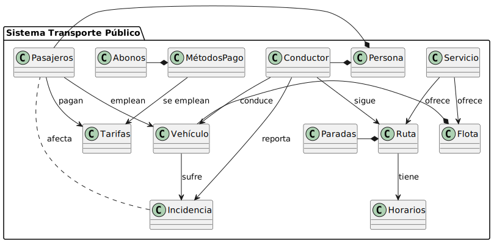
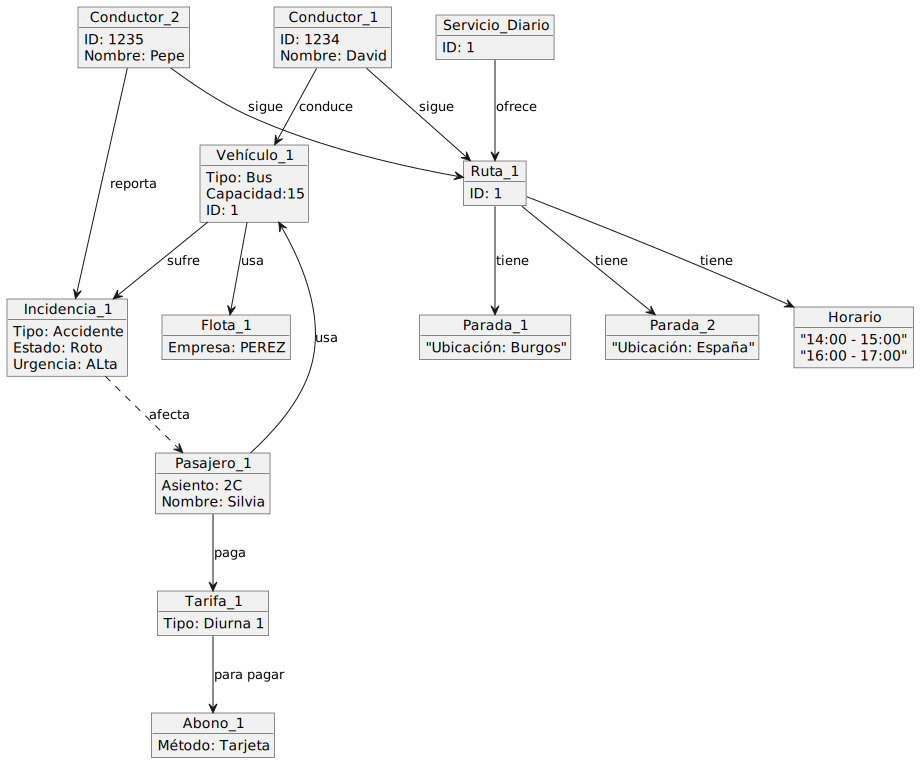
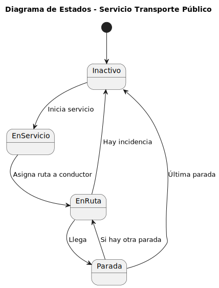
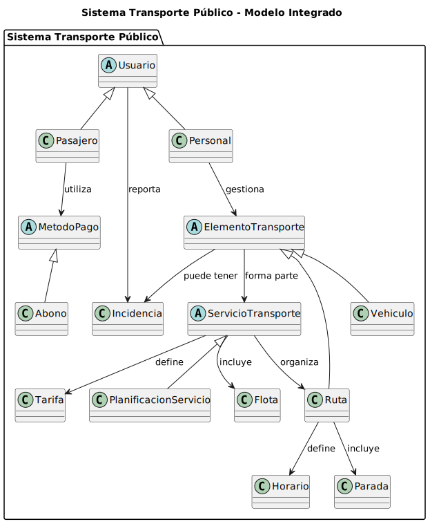
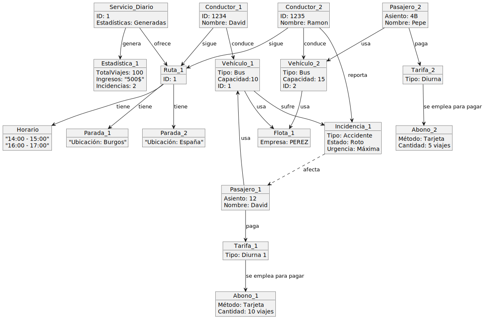
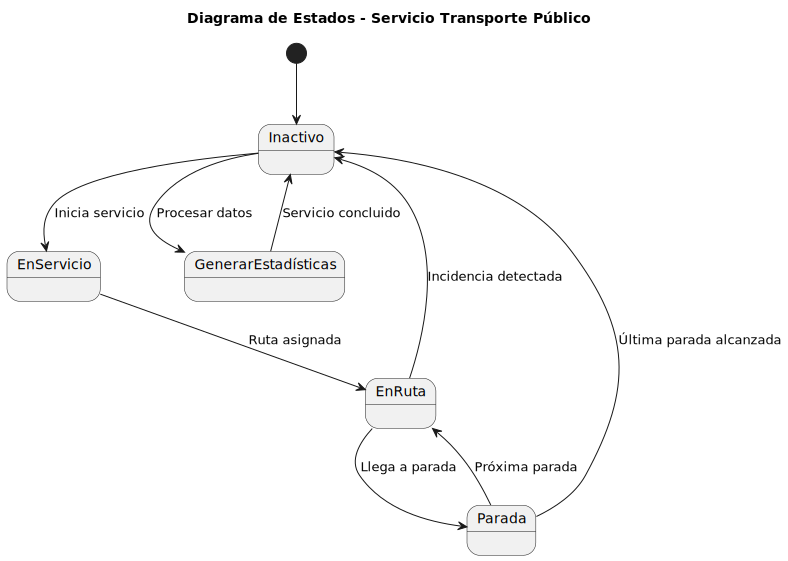

| Imagen                                                   | Código                                                  |
|----------------------------------------------------------|--------------------------------------------------------|
|  | [Ver código](modelosUML/DiagramaClasesExamen.puml)     |
|  | [Ver código](modelosUML/DiagramaObjetosExamen.puml)   |
|  | [Ver código](modelosUML/DiagramaEstadosExamen.puml)   |
|  | [Ver código](modelosUML/NuevaIteracionDiagramaClases.puml) |
|  | [Ver código](modelosUML/NuevaIteracionDiagramaObjetos.puml) |
|  | [Ver código](modelosUML/NuevaIteracionDiagramaEstados.puml) |
