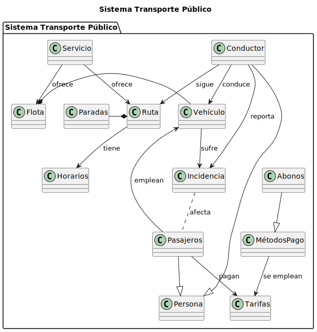
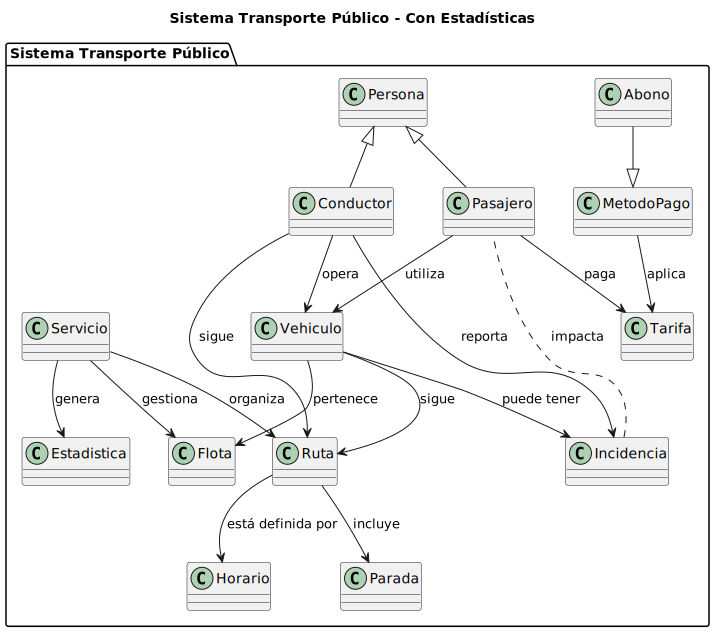

| **Imagen**                                               | **Código**                                              |
|----------------------------------------------------------|--------------------------------------------------------|
| **Diagrama de Clases**  | [**Ver código: Diagrama de Clases**](modelosUML/DiagramaClasesExamen.puml)     |
| **Diagrama de Objetos**  | [**Ver código: Diagrama de Objetos**](modelosUML/DiagramaObjetosExamen.puml)   |
| **Diagrama de Estados**  | [**Ver código: Diagrama de Estados**](modelosUML/DiagramaEstadosExamen.puml)   |
| **Nueva Iteración de Clases**  | [**Ver código: Nueva Iteración de Clases**](modelosUML/NuevaIteracionDiagramaClases.puml) |
| **Nueva Iteración de Objetos**  | [**Ver código: Nueva Iteración de Objetos**](modelosUML/NuevaIteracionDiagramaObjetos.puml) |
| **Nueva Iteración de Estados**  | [**Ver código: Nueva Iteración de Estados**](modelosUML/NuevaIteracionDiagramaEstados.puml) |
